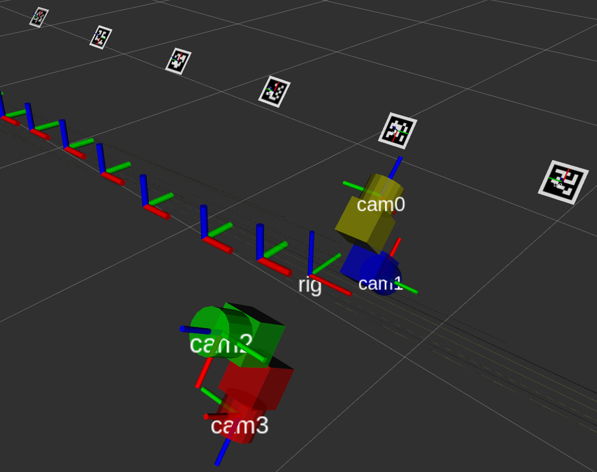

# TagSLAM: Localization and mapping from Tags

TagSLAM is a ROS based package for simultaneous multi-camera localization and
mapping (SLAM) with the
popular [AprilTags](https://april.eecs.umich.edu/software/apriltag).

TagSLAM can also solve several sub problems related to SLAM:

- Mapping: walk around with a camera and discover tag poses whenever
  multiple tags are visible in the same frame.
- Localization: if you have the tags mapped already, you can enter
  their poses as fixed input, and later just localize off those tags.
- Extrinsics camera calibration: TagSLAM supports *synchronized*
  multi-camera systems, and therefore can be used to find the relative
  poses of multiple cameras.

(Image shows the poses of a quad rotor platform flying in a tunnel
(pennstock) with a 4-camera setup, dataset courtesy of Tolga Ozaslan)

