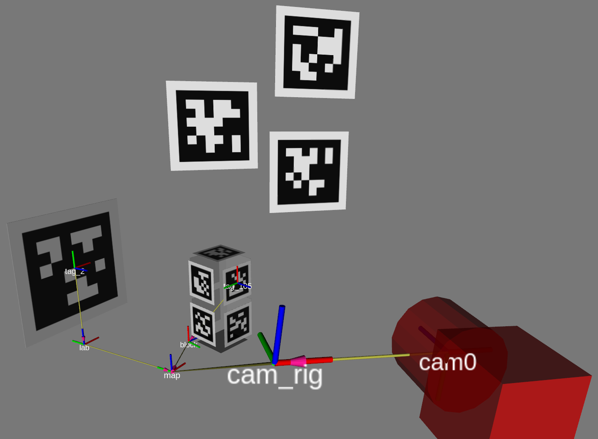

# TagSLAM: Localization and mapping with tags

TagSLAM is a ROS based package for simultaneous multi-camera localization and
mapping (SLAM) with the
popular [AprilTags](https://april.eecs.umich.edu/software/apriltag).

<iframe src="//www.youtube.com/embed/51z1V-Jb3c8?autoplay=0" style="position: absolute; top: 0; left: 0; width: 100%; height: 100%; border:0;" allowfullscreen title="TagSLAM on aerial robot"></iframe>

TagSLAM can also solve several sub problems related to SLAM: mapping only, localization only, extrinsic camera calibration etc.

## Mapping
Walk around with a camera and discover tag poses whenever
multiple tags are visible in the same frame.

## Localization
If you have the tags mapped already, you can enter their poses as fixed
input, and now just localize off those tags.

## Loop closing on visual odometry
If a visual/inertial odometry trajectory and the tag detections *are computed from the same camera frames*, TagSLAM can perform loop closure.

## Extrinsic camera calibration
TagSLAM supports *synchronized* (only!)  multi-camera systems, and
therefore can be used to find the relative  poses of multiple
cameras. No special calibration target is needed other than AprilTags
scattered around. No overlap between the cameras field of view is required.

## State estimation
TagSLAM can estimate the pose of an object that has tags attached to
it. 

  <iframe src="//www.youtube.com/embed/ul9THWqCOQY?autoplay=1" style="position: absolute; top: 0; left: 0; width: 100%; height: 100%; border:0;" allowfullscreen title="TagSLAM state estimation"></iframe>

<!--


-->
