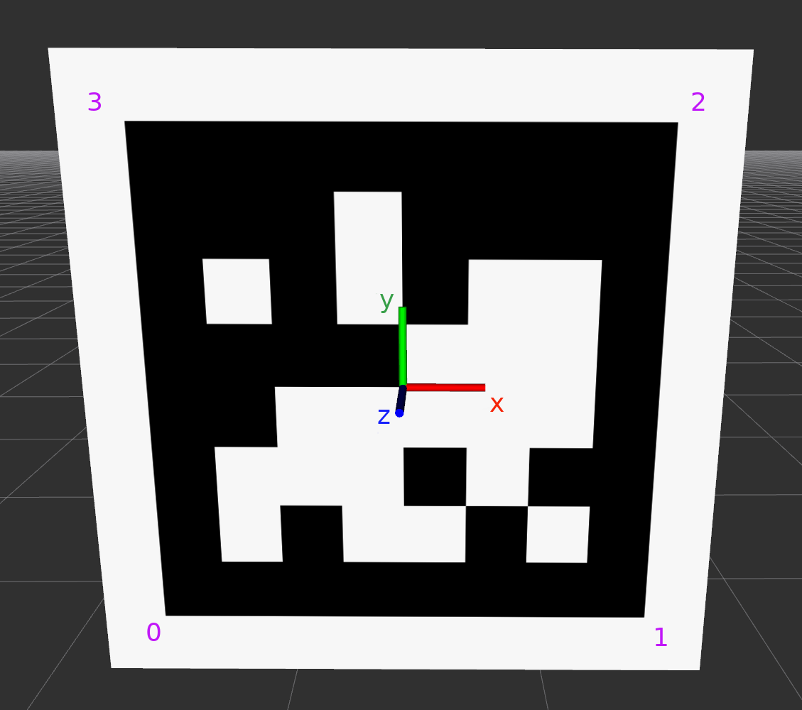

+++
date = "2015-07-18T14:08:35+02:00"
draft = false
title = "Concepts"
weight = 20
+++
# Notation for transforms
In the following, transforms written as:
$$
\ctrans{T}{A}{B}
$$
<html>

</html>
take coordinates $\cvec{X}{A}$ in  frame $\mathrm{A}$ and express them in frame $\mathrm{B}$:
$$
\cvec{X}{B} = \ctrans{T}{A}{B}\ \cvec{X}{A}
$$

# Bodies
In TagSLAM, every tag is associated with a body, and tag poses are
given relative to that body. Likewise, every camera must be associated with 
a body, and camera poses are expressed with respect to that
body.

Consider the following scene:

In the example above, for the camera to localize itself, the "lab" body's world pose $\ctrans{T}{lab}{map}$ must be specified, as well as
the pose $\ctrans{T}{tag\\_2}{lab}$ of the tag with respect to the lab.
Also needed is the pose $\ctrans{T}{cam0}{cam\\_rig}$ of the camera with respect to the body it is attached to ("cam_rig").

For the block to be localized by TagSLAM, we only need to provide $\ctrans{T}{tag\\_105}{block}$. When the camera sees tags 2 and tag 105 at the same time, it will be able to infer the missing transform $\ctrans{T}{block}{map}$.

# Poses

Poses can be classfied according to their time dependence:

- Static poses: such poses do not change over time, i.e. TagSLAM will
  maintain a single variable throughout the entire data set. An
  example would be the pose of the lab $\ctrans{T}{lab}{map}$.

- Non-static poses: they can potentially change with every
  frame. An example would be the pose $\ctrans{T}{cam\\_rig}{map}$ of
  the camera rig or the pose $\ctrans{T}{block}{map}$ of the block.
  
Note that *tag and camera poses are always static*! That means they do
not change with time, i.e. TagSLAM assumes one constant pose over
time. However, the *body* to which the tags or cameras are attached
can have a time dependent pose! 

Further, static poses are distinguished by prior knowledge:

- Known poses: the pose is already known at the start, for instance
  from a previous run of TagSLAM.
- Unknown poses: the pose, although static, is unknown at the
  beginning, and must be discovered on the fly.

# Specifying poses

Poses in TagSLAM are given as position and rotation components (SE(3)). The
rotations are specified as a rotation vector, i.e. the log of the
rotation matrix. The direction of the rotation vector specifies the
rotation axis, the length of it the rotation angle in radians. Use
Andre Gaschler's handy [rotation
converter](https://www.andre-gaschler.com/rotationconverter/) to
convert to and from "axis with angle magnitude (radians)".

# Convention for tag poses

Here is how the coordinate axes are oriented when facing an upright
AprilTag. Also note the corner numbering in purple.

