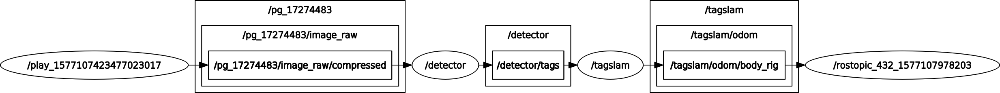

+++
date = "2015-07-18T14:08:35+02:00"
draft = false
title = "Troubleshooting"
weight = 100
+++
## 1) TagSLAM is not doing anything
This problem is often encountered when running TagSLAM in online mode. There are several common reasons for that.

### a) ROS topic mismatch
ROS topic mismatch: are all input topics matched to output topics? The pedestrian way to check it is this: run ``rosnode list`` to see what your node names are. For the example, you should get output that looks like this:

    /detector
    /play_1577107423477023017
    /tagslam

Does the /tagslam node find the topics it needs? You can find out with ``rosnode info /tagslam``. That should give you output similar to this:
  
    Node [/tagslam]
    Publications:
    * /rosout [rosgraph_msgs/Log]
    * /tagslam/odom/body_rig [nav_msgs/Odometry]
    * /tagslam/path/body_rig [nav_msgs/Path]
    * /tf [tf2_msgs/TFMessage]
	  
    Subscriptions:
    * /clock [rosgraph_msgs/Clock]
    * /detector/tags [apriltag_msgs/ApriltagArrayStamped]

Looks good. Let's say the /detector/tags topic was not published by any node, the ``Subscriptions`` section would look like this:

    Subscriptions:
    * /clock [rosgraph_msgs/Clock]
    * /detector/tags [unknown type]

The moment you see ``[unknown type]``, something is wrong. You can double check with ``rostopic info /detector/tags`` to confirm that nobody is publishing that topic:

    Type: apriltag_msgs/ApriltagArrayStamped
    Publishers: None
    Subscribers:
    * /tagslam (http://enz:38275/)

Follow the chain of published topics all the way up to the camera node. Use ``rostopic hz <topic_name>`` at every step to check if a topic is indeed receiving data.
	
The faster way to check if topics are connected is by using ``rqt_graph``, which will show you the graph of all connected topics:
	
  
### b) ROS topic not ticking

Use the ``rostopic hz`` command to verify that each topic along the chain is producing data

### c) Data is not synced

If tags from multiple cameras are used, they must be synchronized across cameras, i.e. their message time stamps must be *identical*. If you use external odometry, the time stamps of the odom messages need to also be identical to the image stamps. Use ``rostopic echo`` simulataneously on all topics that TagSLAM is subscribed to. Are the header "stamps" of all images *and the odometry messages* (if you are using external odom) identical? Check with ``rostopic echo`` (by appending ``/header`` to the topic you can avoid printing out the whole image):

    rostopic echo /pg_17274483/image_raw/compressed/header
    seq: 20
    stamp:
        secs: 1558997723
        nsecs: 150345650
    frame_id: "pg_17274483"
	---

### d) No clock published

If you play back data from a bag, check that you have done ``rosparam set use_sim_time true``

## 2) TagSLAM kinda works, but sometimes jumps around all over the place.

Usually this is due to poor image quality and/or motion blur due to poor lighting and long shutter times. The RealSense cameras are notorious for long shutter times because they have a small image sensor.

*Check your images!* How many tags are visible at any point? Use the debug images from the detector, with the inpainted tags. If you only see one tag, you will get poor localization, and if it's far away, your position will be all over the place. In that case, put up more tags, it helps even if you don't measure their pose.

In some cases you can get a smoother trajectory by switching on "fake odometry". This results in temporal averaging that gives smoother trajectories, but also introduces temporal lag that is hard to quantify.

## 3) At some point along the path, TagSLAM bombs out / 'flies away' etc

Often this is due to loop closure that happens when e.g. your odometry has drifted significantly, and TagSLAM cannot close the loop because the error is too big. Sometimes you can work around the problem by increasing the permissible subgraph error. Or you can bump the noise on the odometry, such that TagSLAM has an easier time "bending" the trajectory into place upon loop closure.

## 4) There is a nasty kink in the trajectory

Several reasons:

 - input static pose, number, or size of a tag is wrong
 - that nasty kink comes from a jump in the odometry, while no tags are visible. Find out what's going on with the odom
 - TagSLAM failed on the loop closure, and consequently had to drop some factors from the graph because the subgraph error was too high. The dropped factors include the odometry factors, which results in a kink in the trajectory

## 5) Sometimes there are a few poses in the trajectory that are total outliers

This typically indicates that the rig pose initialization was bad. Usually this is due to poor tag visibility. You can paper over some of those issues by switching on "fake odometry". This often helps because then TagSLAM initializes the camera rig pose from the previous (t-1) pose, instead of initializing it at every time step from scratch off of the tags. Alas, this also hides the root cause: you have locations along your path where only a few tags are visible from far. The other option is to simply remove the offending observation from your data with a ``squash`` section.

## 6) The trajectory goes almost straight through the tags

Check that your tag size is correct.

## 7) The camera moves weirdly crooked, and consistently points the wrong way

Your image center is off. Check that you are using the right intrinsic calibration.

## 8) Lots of messages about dropped tags due to viewing angle.

If those tags are mostly near the image boundaries it is indicative of
poor intrinsic calibration. Ensure that the calibration target covers the
very extreme image corners.

## 9) TagSLAM bombs out in the GTSAM solver

When tags occupy a small pixel area and/or are viewed at shallow angle
the initialization can be bad, leading to unrecoverable
errors. This happens particularly when using the UMich detector, which
has become very good at detecting small tags at shallow angles.
Bump the ``minimum_viewing_angle`` and ``minimum_tag_area`` parameters
to drop such detections.

