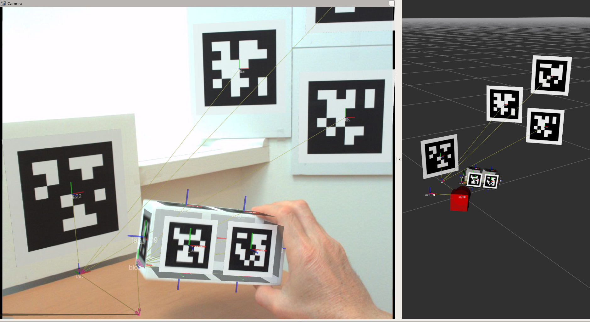

+++
date = "2015-07-18T14:08:35+02:00"
draft = false
title = "9. Visualization"
+++
# How to render the tags in rviz

The ``tagslam_viz`` package has python code to generate urdf models
for the tags. The urdf is generated for all tags listed in the
``poses.yaml`` file that is produced when you run TagSLAM. Here is how to
generate the urdf, and load it into the ROS parameter space:

    roslaunch tagslam_viz visualize_tags.launch tag_id_file:=$HOME/.ros/poses.yaml

Now in rviz, you add a "RobotModel", and change the "Robot
Description" from "robot_description" to "tags". All that is missing
now is a transform from tag to world frame. So run TagSLAM again, and
you should see the tags rendered.

# How to get the rviz "Camera" feature to work
For the "Camera" feature in rviz to work properly you need:

- an *undistorted* camera image.
- a valid and synchronized "camera_info" topic in the bag
- a valid transform from camera to map
- a matching "frame_id" for transform, camera\_info, and image

Only if all these requirements are fulfilled will rviz overlay the
camera image with the 3d world.

## Massage the bag

To start, the topics in your bag should look like this:

    topics:      /camera/camera_info     1724 msgs    : sensor_msgs/CameraInfo
                 /camera/compressed      1724 msgs    : sensor_msgs/CompressedImage

You can massage the bag topic scheme by using the topic renamer tool:

    rosrun rosbag topic_renamer.py <in topic> <in bag> <out topic> <out bag>

If you don't have the camera info in the bag, add it like so:

    rosrun tagslam add_camera_info.py --out_bag output.bag --caminfo_file camerainfo.yaml --caminfo_topic /camera/camera_info --image_topic /camera/compressed input.bag

Verify that your camera\_info and image messages have a frame\_id of
"cam0" in the header. If not, change the frame_id like this:

    rosrun bag_tools change_frame_id.py -o OUTPUT_BAGFILE -i INPUT_BAGFILE -f cam0 -t /camera/camera_info /camera/compressed

## Run rviz and necessary modules
First, run a module to decompress the image:

    rosrun image_transport republish compressed in:=/camera out:=/camera/image_raw
	
Now you need to run the image_proc module in the namespace of your camera
to get a rectified (undistorted) image. This is very important. If you use the non-rectified image, the projections done by rviz will not be lining up with the camera image. 

    ROS_NAMESPACE=camera  rosrun image_proc image_proc

Next, create a Camera window in rviz, subscribing to the topic
"/camera/image_rect_color". Then run a detector node to decode the
images, run tagslam to produce valid cam0-to-map transforms, and play
the bag. The Camera in rviz should start displaying images now.

To get the tags to visualize, first run tagslam for a while so you
have all the valid tag poses. Then dump them into a file:

    rosservice call /tagslam/dump

and load all required tags into the parameter space:

    roslaunch tagslam_viz visualize_tags.launch tag_id_file:=$HOME/.ros/poses.yaml

Likewise all cameras:

    roslaunch tagslam_viz visualize_tags.launch cameras_file:=full_path_to_cameras.yaml

If the camera calibration is correct, the resulting Camera display in
rviz should have only small projection errors, as in the image below.

	
